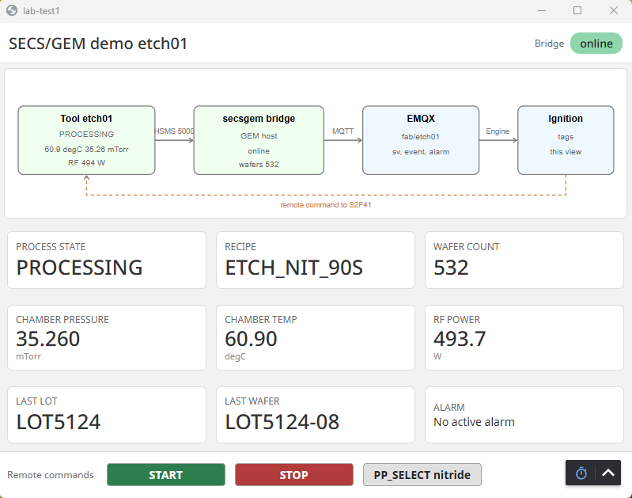
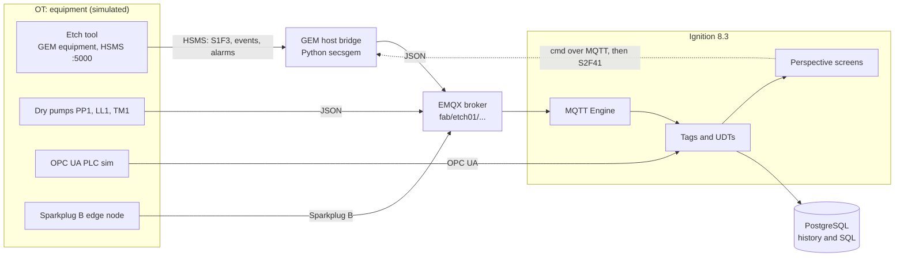
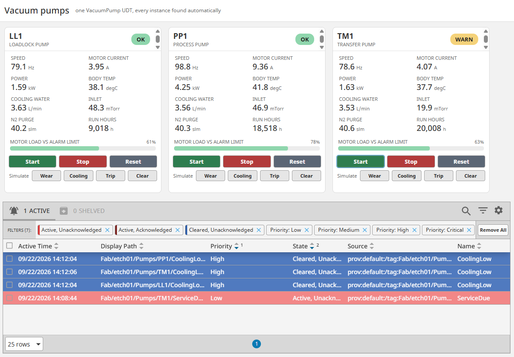
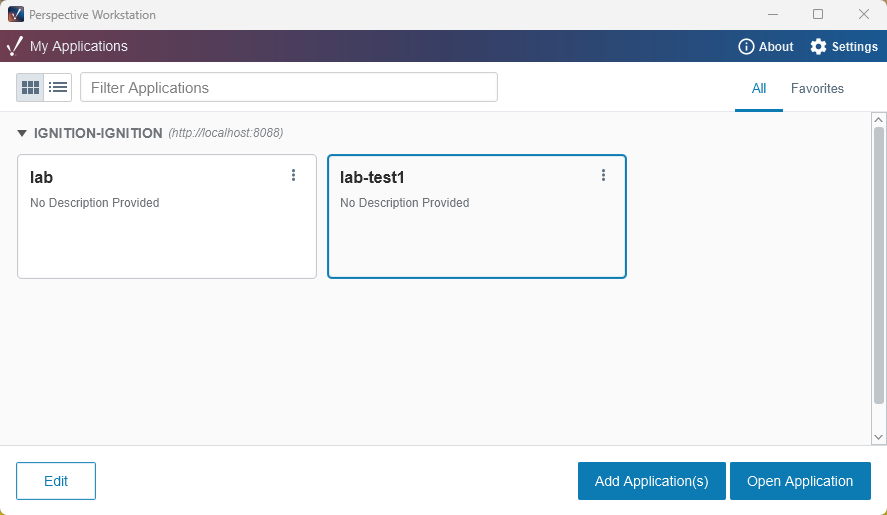

# Ignition IT/OT Lab

A self-contained lab for semiconductor and manufacturing integration on **Ignition 8.3**. It runs entirely in Docker on one machine. Two demos sit on top of the base stack:

1. **SECS/GEM to Ignition.** A simulated etch tool speaks SECS/GEM over HSMS. A Python GEM host bridges it to MQTT, and an Ignition operator screen sends remote commands back to the tool.
2. **Vacuum pump UDT.** One `VacuumPump` User Defined Type drives three simulated dry pumps, with limits, health logic, alarms and history defined once and reused per pump.

Built by Christoph Viehoff, Automation and Controls Engineer, Portland, OR.



## Architecture



Every service is a container on one Docker network. The equipment side is simulated, but the protocols, topic structure and Ignition configuration match what a fab or plant uses.

## Demo 1: SECS/GEM to Ignition

| Piece | What it does |
|---|---|
| [`secsgem/equipment_sim.py`](secsgem/equipment_sim.py) | GEM equipment with 6 status variables, 2 data values, 5 collection events, an OverTemp alarm and START, STOP and PP_SELECT remote commands |
| [`secsgem/host_bridge.py`](secsgem/host_bridge.py) | GEM host: polls S1F3, subscribes to events and alarms, publishes to MQTT, turns MQTT commands into S2F41 and returns HCACK |
| [`secsgem-demo/SecsGemDemo`](secsgem-demo/SecsGemDemo) | Perspective view with a live flow diagram, process tiles, alarm tile and command buttons |

A command's round trip: button, MQTT `fab/etch01/cmd`, bridge, S2F41, tool replies S2F42 HCACK 4, new state appears on the next poll within about 2 seconds.

Details: [SECS-GEM-Ignition-Demo.pdf](secsgem-demo/SECS-GEM-Ignition-Demo.pdf)

## Demo 2: Vacuum pump UDT



| Piece | What it does |
|---|---|
| [`pump-demo/1-VacuumPump-UDT.json`](pump-demo/1-VacuumPump-UDT.json) | The UDT: 4 parameters, 11 reference tags, overridable limits, 7 alarm tags, Health and load percentage |
| [`pump-demo/2-Pump-instances.json`](pump-demo/2-Pump-instances.json) | Three instances. LL1 and TM1 override the current limits. |
| [`pump-demo/pump-sim/pump_sim.py`](pump-demo/pump-sim/pump_sim.py) | Dry pump simulator with bearing wear, loss of cooling, trip and service-due scenarios. It also reacts to the etch tool's process load. |
| [`pump-demo/views/Pumps`](pump-demo/views/Pumps) | A PumpCard view that takes one instance path, and an overview that finds every instance by itself |

Adding a pump means adding one UDT instance. The screen, alarms and history follow with no view changes.

Details: [VacuumPump-UDT-Showcase.pdf](pump-demo/VacuumPump-UDT-Showcase.pdf)

## Run it

Needs Docker Desktop and the free Cirrus Link MQTT Engine module (see [`modules/README.md`](modules/README.md)).

```powershell
copy .env.example .env        # then set the passwords
docker compose -f docker-compose.yml -f compose.mqtt-modules.yml -f docker-compose.secsgem.yml -f pump-demo/docker-compose.pump.yml up -d --build
```

Then open http://localhost:8088. To load the demos into a project:

* SECS/GEM view: `.\import-secsgem-view.ps1 -Project <name>`
* Pump tags: in the Designer, import `pump-demo/1-VacuumPump-UDT.json` in the UDT Definitions tab, then `2-Pump-instances.json` in the Tags tab
* Pump views: `.\pump-demo\import-views.ps1 -Project <name>`

Full setup for the base stack (database, OPC UA, MQTT, licensing, troubleshooting) is in [docs/LAB-SETUP.md](docs/LAB-SETUP.md).



## Problems solved along the way

| Symptom | Cause | Fix |
|---|---|---|
| Bridge could not reach the broker | Overlay services joined Compose's default network, not the lab network | Put every service on the shared `lab` network |
| Flow diagram showed a quality error | One wrong tag path (`status/online/value`) made the whole expression bad quality | Corrected the path to match the JSON payload |
| Buttons reported "sent" but nothing happened | Publish targeted server `emqx`, but MQTT Engine names it `Chariot SCADA`, and no error was raised | Server name moved to one view property, checked with `mosquitto_sub` and the bridge log |
| UDT alarms missing after import | Ignition 8.3 silently dropped the alarm list because of one unsupported field | Exported a hand-made alarm to learn the exact format, then rebuilt the file |
| CoolingLow flickered on every pump start | Running and CoolingFlow arrive as separate MQTT messages | Active delay on the alarm in the UDT, applied to every pump at once |

## Stack

Ignition 8.3.9 (Perspective, UDTs, alarming, MQTT Engine) · EMQX 6.2 · PostgreSQL 17 · Python with secsgem and paho-mqtt · Microsoft OPC PLC simulator · Docker Compose · PowerShell

## Notes

* All equipment is simulated. No vendor code or customer data is included.
* The Cirrus Link modules and gateway backups are not in the repo for licensing and size reasons.
* The gateway runs in Ignition trial mode, which resets every two hours.
